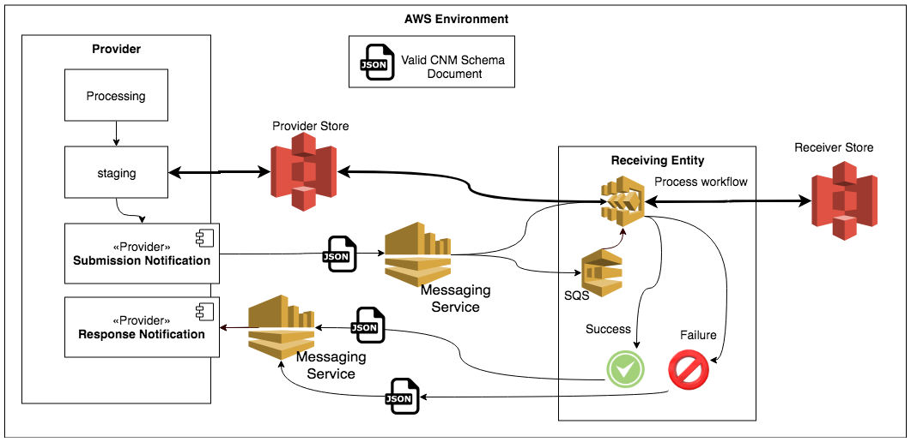
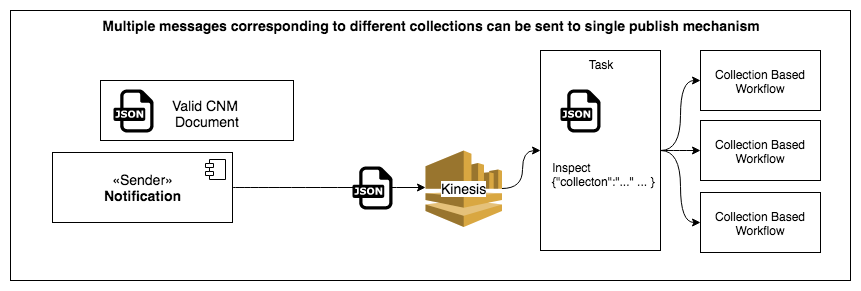

# cumulus-sns-schema

The cumulus SNS schema is used to interface providers with cumulus/AWS ingestion pipelines. It can be thought of as a stripped down version of the PDR/PAN interface for ingestion within the AWS environment (i.e. S3 staged products).

## Abstract

This document identifies the [Cloud Notification Mechanism] as an ESDIS standard interface mechanism. The [CNM] leverages the AWS Simple Notification Service (SNS) to coordinate a push-based notification mechanism for ingestible data between two cloud-based entities.  For example, the delivery of data between a Science Investigator-led Processing System (SIPS) and a DAAC or visualization products between a SIPS and the Global Imagery Browse Services (GIBS) system.  The messages detail a granule, or visualization product, and the associated files. The [CNM] allows for an optional response message from notifying of a success or error of the previously received message.

## Introduction

The PDR mechanism has served EOSDIS well for quite a while, and while it will continue to be used as an FTP-based transfer mechanism, providers and data created in the cloud have an array of tools and services available of which we should take advantage. As ingest systems and the archive become scalable and more performant, an updated transfer scheme is needed to enable that performance and scalability. This is the purpose of the [Cloud Notification Mechanism]. The influence of the PDR on the CNM design is unquestionable, but there are a few differences of note, most notably in the language used to write the messages (JSON vs PVL), required fields, and the response message being optional.

## High level Differences from PDR

* Pure push mechanism, no polling by DAACs or SIPS
* Single granule notification, not multi granule availability
* Success response messages are optional
* JSON vs PVL
* Stripped down required fields and overloaded data types

[PDR/PAN spec](https://cdn.earthdata.nasa.gov/conduit/upload/6376/ESDS-RFC-030v1.0.pdf)

## Overview of the CNM

1. A SIPs or SDS processes data files and stages them in a bucket. All files for a single granule must be in the same bucket, but multiple buckets can be used to store multiple granules in their entirety.
2. The SIPS or SDS generates a [CNM] message for each granule detailing various bits of information defining the granule to be ingested. the SIP generates a unique identifier (uuid, sequence, etc) for this message as one of the fields. Fields are defined below.
3. The CNM message is sent to an AWS SNS Topic or Kinesis Stream that has been previously agreed to be both DAAC and SIPS or SDS in an ICD.
4. The CNM message is received by the daac from the SNS Topic or Kinesis Stream and either queued for eventual processing or immediately processed by the cumulus framework
5. Cumulus processes the message to determine the location of granule files, and retrieve these files from the SIPS or SDS data store, writing them to the Archive Data Store.
6. Cumulus continues processing the granule as per nominal ingestion
Upon completion, a CNM Response messages can optionally be sent to a previously agreed upon SNS Topic or Kinesis Stream maintained by the SIPS or SDS (defined in an ICD) detailing the message ID and the status message (in this case, success).
7. Upon failure, the CNM Response message will be sent to a previously agreed upon SNS Topic or Kinesis Stream maintained by the SIPS or SDS (defined in an ICD) detailing the message ID and the status message (in this case, a failure).

## Specification
There are two types of messages valid in the CNM. The first message is the notification of new data to a DAAC. The second is the optional response message sent from a DAAC to a SIPS.

See https://git.earthdata.nasa.gov/projects/CUMULUS/repos/cumulus-sns-schema/browse/cumulus_sns_schema.json for an up-to-date JSON Schema.

### Notification Message Fields

The below fields are for sending a CNM submission, most often from a SIPS or SDS to a DAAC (i.e. from provider to archive). For responses fields, please see "Response Message Fields" below.

| field | required | Definition | Notes|
|-------| ---------| ------- | ----- |
|version |	yes	| Version of the CNM to use/parse with |	1.0, 1.1, 1.2, 1.3 |
| submissionTime |	yes |	The time the message was created (and presumably sent) to the DAAC Topic/Stream.	| |
| identifier |	yes |	Unique identifier for the message as a whole. It is the senders responsibility to ensure uniqueness. This identifier can be used in response messages to provide traceability.	|  |
| collection |	yes |	The collection to which the granule belongs. |	This may be used if a generic SNS topic for multiple providers.   It can be either a string for the collection short name (e.g. <i> GLDAS_NOAH025_3H </i>), or a JSON object including the collection name and version (e.g. <i> {"name":"GLDAS_NOAH025_3H", "version":"2.0"} </i>). |
| provider |	no |	The provider/SIPS identifier which created this message.	| |
| product |	yes |	A product object (typically a granule), defined below. Only a single product can be defined in each message.	|
| trace |	no	| Information on the message or who is sending it. This is not used in the processing of the product. informational only.	|

### Product Fields

| field | required | Definition | Notes|
|-------| ---------| ------- | ----- |
|name 	|yes |	The name of the product to be processed. |	Probably matches to the cumulus granule ID. |
|dataVersion |	no |	versions number/string of the granule.
| dataProcessingType | no | The type of data processing stream that generated the product. | Valid values are "forward" or "reprocessing" |
| files |	no |	An array of fileObjects the make up the granule.|	See the file entries below for properties of a file object. |
| filegroups |	no	| One of 'files' or 'filegroups' is required. An array of filegroups to which the files of a product belong. | One of 'files' or 'filegroups' is required. Filegroups are defined in the tables below. This was initially created for GIBS as the grouping of multiple files for a specific resolution was required, and it was a simple way of ignoring file name parsing to retrieve the information. |

### File Fields

| field | required | Definition | Notes|
|-------| ---------| ------- | ----- |
| type |	yes	| The type of file. science files (netcdf, HDF, binary) should use the 'data' type. More can be added if need and consensus demand.	| Data types are defined in the 'data types' section below.|
|subtype|	no	|An optional, specific implmentation of the file::type. e.g. NetCDF for a file of type 'data'	|
|uri |	yes	| The URI of the file (s3://...)	|
|name |	yes |	The name of the file. |	Some providers will only create hashes (to maximize read/write performance to/from S3 buckets). as object keys. We need a way to define what the object name should be, and explicitly told (not guessing). |
|checksumType	|yes|	Type of the checksum (e.g. md5).  Optional.	||
|checksum |	yes |	Checksum of the file.	||
|size |	yes|	Size, in bytes, of the file.	||

### Filegroups Fields

| field | required | Definition | Notes|
|-------| ---------| ------- | ----- |
| id 	|yes |	text identifier of the filegroup |	 |
| files |	yes |	An array of fileObjects the make up the granule.|	See the file entries above for properties of a file object. |

### Data types
| Data Type | Example Files | Notes |
|-------| ---------| ------- |  
| data |	NetCDF files, HDF file, binary science files	||
|browse |	png, jpeg, GIBS browse images	||
|metadata |	checksums, ODL or XML, production history	||
|qa|	Quality Assessment files	||
|linkage|	Linkage to another file or archive entry, generally by product identifier	||

### Response Message Fields
The below fields are for sending a CNM response, usually from a DAAC to a SIPS or SDS (i.e. from archive to provider). For submission fields, please see "Notification Message Fields" above. The response for successful granules is OPTIONAL per the ICD between the SIPS or SDS and DAAC. It is recommended to send a response.

| field | required | Definition | Notes|
|-------| ---------| ------- | ----- |
|submissionTime	| yes	| The time the message was created (and presumably sent) to the DAAC Topic/Stream. |	In a response, this field should be copied from the incoming message. |
| receivedTime |	yes |	The time the message was received by the DAAC	|
|processCompleteTime	|yes|	The time ingest completed (or error encountered) by the DAAC	|
|identifier	|yes	|The SIPS generated unique identifier for this message.	|must be kept from the original CNM|
|collection	|yes|	The collection for which the granule belongs.	|This may be used if a generic SNS topic for multiple providers.|
|response|	yes|	A response object, defined below.||

### Response Object fields
| field | required | Definition | Notes|
|-------| ---------| ------- | ----- |
|status |	yes |	"SUCCESS" or "FAILURE"	||
|errorCode |	no |	"VALIDATION_ERROR", "PROCESSING_ERROR", "TRANSFER_ERROR" |	Not required, unless this response is for an error |
| errorMessage	| no |	A more descriptive message for failure than the above code. This could be a stack trace or a human readble message: file size mismatch, or "file not found on host system". |	Not required, unless this respone is for an error |

## Best Practices
* Topics should be owned by the group receiving the messages. In the example given above, the SNS topic used in step 3 would be owned and maintained by the DAAC. Likewise, the response topic in step 7 & 8  would be owned and maintained by the SDS or SIPS.
* A single topic should be able to support multiple collection types. That is, a SIPS or SDS may send messages for multiple collections to a single topic. See below image.
* Unless there is a pressing reason not to, the response message should be used in cases of both success and failures, even though success responses are optional.
* It is recommended to store erroneous messages in a persistent storage mechanism, such as S3, for the life of the project.
* It is recommended to store all messages in a persistent storage mechanism, such as S3, for at least 30 days.
* Optionally, storing incoming and response messages in something like an ELK stack allows simple querying, status, and latency metrics to be calculated.
* If the message received from a queue, topic, or stream is unparseable, e.g. doesn't validate or an error occurs, try and capture as much information from the CNM as possible. Attempt to capture the `identifier` and issue a CNM response detailing the failure using a 'VALIDATION_ERROR' along with the text of the offending message.
* if the identifier cannot be read from an invalid message, using the AWS identifier of the message can be used as a 'identifier of last hope'. Full message and other pertinent details should be included in the CNM Response
* Ensure best practices for the communication mechanism in use:
  * SNS Topics should be backed by an AWS Simple Queue Service
  * SQS Topics should have a dead-letter-queue associated with them for processing issues
  * Kinesis streams should be able to recover from [stream batch errors](https://aws.amazon.com/about-aws/whats-new/2019/11/aws-lambda-supports-failure-handling-features-for-kinesis-and-dynamodb-event-sources/).

## Examples

Examples can be found in the [samples](samples) directory
